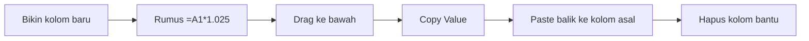

# 📊 **TUTORIAL EXCEL TIPS & TRICKS**
> *Master Guide untuk Excel Power Users* 💪

<div align="center">
  
🎯 **12 Tips Excel yang Akan Mengubah Cara Kerja Anda!** 🎯

</div>

---

## 🔗 **1. Hyperlink ke Workbook & Sheet Tertentu**
> 💡 *Navigasi antar file Excel dengan presisi tinggi*

### 📋 **Langkah-langkah:**
- 🖱️ Buka menu **Edit Hyperlink** `(Ctrl+K)` di cell G9
- 📁 Di kolom **Address** bagian bawah (path file `.xlsx`), **jangan hapus** isinya
- ⌨️ Ketik tambahan ini di **ujung paling belakang**:
  
  ```excel
  #'[gantidengan nama sheet-langsung copas full]'![ganti dengan cell yang dituju]
  ```

---

## 📄 **2. Hyperlink ke PDF dengan Page Tertentu**
> 🚀 *Buka PDF langsung ke halaman yang diinginkan via VBA*

### 🔧 **Setup VBA Script:**
📝 **Copy script ini ke VBA Editor** → `Alt + F11 > Double Click Sheet > Paste`

<details>
<summary>🔽 <strong>Klik untuk melihat VBA Code</strong></summary>

```vba
    ```
      Private Sub Worksheet_FollowHyperlink(ByVal Target As Hyperlink)
        '=========================================================================
        ' GHOST LINK PDF OPENER - ROBUST VERSION
        ' - Membaca PDF path dari ScreenTip
        ' - Bypass default PDF viewer
        ' - Cascade browser: Edge ? Chrome ? Firefox
        '=========================================================================

        Dim RawPath As String
        Dim CleanPath As String
        Dim WSH As Object
        Dim Browser As Variant
        Dim BrowserList As Variant
        Dim i As Long
        
        '-------------------------------------------------------------
        ' 1. Ambil ScreenTip (Ghost Link Source)
        '-------------------------------------------------------------
        On Error Resume Next
        RawPath = Target.ScreenTip
        On Error GoTo 0
        
        ' Guard clause: kalau kosong atau bukan PDF, lepas
        If Len(RawPath) = 0 Then Exit Sub
        If InStr(1, LCase(RawPath), ".pdf") = 0 Then Exit Sub
        
        '-------------------------------------------------------------
        ' 2. Normalize Path biar browser ngerti
        '-------------------------------------------------------------
        CleanPath = Replace(RawPath, "\", "/")
        
        If InStr(1, LCase(CleanPath), "file:///") = 0 Then
            CleanPath = "file:///" & CleanPath
        End If
        
        '-------------------------------------------------------------
        ' 3. Siapkan WSH & daftar browser (Cascade Logic)
        '-------------------------------------------------------------
        Set WSH = CreateObject("WScript.Shell")
        
        BrowserList = Array( _
            "msedge", _
            "chrome", _
            "firefox" _
        )
        
        '-------------------------------------------------------------
        ' 4. Eksekusi Cascade Browser
        '-------------------------------------------------------------
        On Error Resume Next
        
        For i = LBound(BrowserList) To UBound(BrowserList)
            Err.Clear
            Browser = BrowserList(i)
            
            WSH.Run Browser & " """ & CleanPath & """", 0, False
            
            ' Kalau sukses ? keluar loop
            If Err.Number = 0 Then Exit For
        Next i
        
        ' Kalau semua browser gagal
        If Err.Number <> 0 Then
            MsgBox "Gagal buka PDF." & vbCrLf & _
                  "Edge / Chrome / Firefox tidak ditemukan.", vbCritical
        End If
        
        On Error GoTo 0
        
        '-------------------------------------------------------------
        ' 5. Biar Excel gak loncat-loncat
        '-------------------------------------------------------------
        Target.Range.Select
    End Sub
```

</details>

### ⚙️ **Setup Manual Link:**
1. 🖱️ **Klik Kanan** di Cell Nominal (misal G9) > Link `(Ctrl+K)`

2. 📂 Di panel kiri, pilih **Place in This Document**
3. 📋 **Type the cell reference:** Masukkan cell itu sendiri (misal G9) atau A1
4. 🏷️ **Text to display:** Pastikan angkanya benar (misal 2.900.000.000)
5. 💬 Klik tombol **ScreenTip...** di pojok kanan atas
   - 📄 Di kotak **ScreenTip text**, PASTE PATH LENGKAPNYA
   - 📌 **Contoh:** `D:\KERJA\DHJ\Kontrak.pdf#page=6`
   - ✅ Klik **OK**
6. ✅ Klik **OK** lagi untuk menutup jendela Link

---

## ⚡ **3. "Center Across Selection" - Pengganti Merge Cells**
> 🎯 *Solusi cerdas untuk text alignment tanpa merusak struktur data*

### 🚨 **Mengapa Merge Cells Berbahaya?**

⚠️ **Karena Anda sekarang menggunakan VBA dan Python (Pandas), musuh terbesar adalah Merged Cells:**

| ❌ **Problem** | 🔍 **Impact** |
|---|---|
| VBA Error | Sering error baca range kalau ada merged cells |
| Sorting & Filter | Tidak bisa jalan di merged cells |
| Copy-Paste | Sering terjadi error |

### 💡 **Solusi: Center Across Selection**

🛡️ **Jangan pernah Merge Cells lagi untuk judul di tengah!**

### 📋 **Cara Penggunaan:**

1. 📊 **Blok cell** yang ingin ditengahkan (misal A1 sampai E1)
2. ⌨️ Tekan `Ctrl + 1` (Format Cells)
3. 🎨 **Tab Alignment > Horizontal > Pilih "Center Across Selection"**

### 🎉 **Hasil yang Didapat:**

✅ **Visual:** SAMA PERSIS seperti Merge Cells (teks di tengah)
✅ **Struktur:** Cell tetap terpisah (A1, B1, C1, dst)
✅ **Kompatibilitas:** Script VBA dan Python berjalan lancar! 🐍

---

## 🎨 **4. "Custom Views" - Mode Client vs Mode Internal**
> 🎭 *Switching tampilan profesional dalam sekali klik*

### 🎯 **Skenario Nyata:**
📈 Di proyek, Anda memiliki file RAB/RAP dengan data rahasia internal:
- 💰 **Margin**
- 👷 **Upah mandor asli** 
- 📉 **Koefisien asli**

🏢 **Saat presentasi ke Owner/Klien:** Harus hide kolom "dapur"
💼 **Saat kerja internal:** Perlu unhide semua data

### 🔄 **Problem Lama:**
Klik kanan hide/unhide berulang-ulang = **CAPEK!** 😅

### ✨ **Solusi: Custom Views**

#### 🔧 **Setup Process:**

**📋 Step 1: Buat View "INTERNAL"**
1. 📄 Atur tampilan Excel versi **"Lengkap"** (semua kolom terbuka)
2. 📍 Ke menu **View > Custom Views > Add**  
3. 🏷️ Beri nama **"INTERNAL"**

**📈 Step 2: Buat View "CLIENT"**
1. 🙈 **Hide** kolom-kolom rahasia (Margin, RAP, dll)
2. 📍 Ke menu **View > Custom Views > Add**
3. 🏷️ Beri nama **"CLIENT"**

### 🎆 **Cara Pakai:**
📌 **Tinggal panggil "INTERNAL" atau "CLIENT" dari menu!**

⚡ **Excel akan otomatis:**
- 👁️ Hide/unhide kolom
- 🖨️ Atur print area  
- 🔍 Set filter sesuai setting
- ⏱️ **Semua dalam 1 detik!**

---

## 🔍 **5. "Go To Special: Visible Cells Only" (Alt + ;)**
> 🎯 *Copy data filtered tanpa baris tersembunyi*

### 🚨 **Masalah yang Sering Terjadi:**
📂 **Filter data** (misal material "Semen" saja) → **Copy** → **Paste**
❌ **Hasilnya:** Baris hidden ikut ter-copy! 😡

### 💡 **Trik Sakti:**

1. 📊 **Blok data** yang sudah difilter
2. ⌨️ Tekan `Alt + ;` (Titik koma)
3. ✨ Excel akan menyeleksi **hanya yang terlihat**
4. 📋 `Ctrl + C` > `Ctrl + V`
5. ✅ **Dijamin:** Data hidden tidak ikut ter-copy!

---

## 📉 **6. "Watch Window" - CCTV Real-Time untuk Variables**
> 📺 *Monitor perubahan nilai cell secara real-time dari mana saja*

### 😤 **Masalah Klasik:**

📝 **Skenario:** Anda sedang mengedit *Sheet Analisa Harga Satuan* (ganti harga semen)
🎯 **Kebutuhan:** Ingin tahu dampaknya ke *Grand Total* di *Sheet Rekapitulasi* (10 sheet dari situ)

**😑 Cara Lama:** 
```
Ganti angka → Pindah Tab → Cek Total → Balik lagi → Ganti lagi
```
**Hasil:** CAPEK! 😅

### 🎆 **Solusi: Watch Window**

🎥 **Bedanya dengan Camera Tool:** 
- Camera Tool = Gambar saja
- **Watch Window = Live Value** + Detail lengkap!

📊 **Fitur Watch Window:**
- 📄 **Sheet Name**
- 📍 **Cell Address** 
- 💵 **Live Value**
- 📋 **Formula** (lengkap!)

### 🛠️ **Cara Setup:**
1. 📍 Tab **Formulas** > **Watch Window** 
2. ➕ **Add Watch**
3. 📌 Pilih cell yang ingin dimonitor
### 🎉 **Kegunaan Dahsyat:**

📈 **Taruh panel** ini mengambang di pojok layar
⚡ **Ganti harga** di Sheet A → **Angka berubah real-time** walau sumbernya di Sheet Z yang tertutup!
💰 **Perfect untuk:** Simulasi margin/diskon, analisis sensitivitas

> 🏆 **Pro Tip:** Ini seperti dashboard monitoring untuk Excel! 😍

---

## 🕵️ **7. "Go To Special: Constants vs Formulas" - Detektor Kebohongan**
> 🚫 *Quality Control untuk mendeteksi angka hardcode vs calculated*

### 🚨 **Masalah yang Berbahaya:**

💼 **Skenario:** Mendapat file Excel RAB dari Subkon/Vendor
👀 **Tampilan:** Kelihatan rapi dan professional
🤔 **Kecurigaan:** Ada angka "Total" yang di-hardcode manual, bukan hasil rumus `Volume x Harga`

💥 **Risiko:** Saat Volume berubah, Total tetap diam → **BONCOS!** 💸

### 🔍 **Solusi Deteksi:**

#### 🎯 **Mencari Constants (Angka Manual):**
1. ⌨️ Tekan `F5` (Go To) > **Special**
2. ✅ Pilih **Constants** (biarkan *Numbers* dicentang)
3. ▶️ Klik **OK**

#### 🔍 **Hasil Analisis:**
⚡ **Excel akan blok SEMUA cell berisi angka ketikan manual**

🚨 **Red Flag:** Jika kolom "Total Harga" ikut ter-blok padahal harusnya berupa **Rumus**
✅ **Conclusion:** Ada yang hardcode/salah input!

#### 🧮 **Cross-Check dengan Formulas:**
Sebaliknya, pilih **Formulas** untuk mengecek cell yang *calculated* Buat *Quality Control* file orang lain, ini fitur wajib.

---

### 8. "Paste Special: Operation" (Kalkulator Hantu)

  **Masalah:** Lu punya kolom "Harga Satuan" (misal 1000 item). Tiba-tiba Bos bilang: *"Naikin semua harga material 2.5% buat safety factor!"* atau *"Konversi semua dari USD ke IDR pake rate 15.000!"*
### 😫 **Cara Lama (RIBET!):**



### ✨ **Solusi Magic: Paste Special Operation**

#### 🗺️ **Step-by-Step:**
1. ✏️ **Ketik angka** `1.025` (atau rate `15000`) di cell kosong → **Copy**
2. 📊 **Blok seluruh kolom** harga yang ingin diubah  
3. 🖱️ **Klik Kanan** > **Paste Special**
4. ⚙️ Di bagian *Operation*, pilih **Multiply** (Perkalian)
5. ✅ **OK**

### 🎉 **Hasil Instant:**

⚡ **Detik itu juga:** Semua angka dikali 1.025  
✨ **Tanpa:** Kolom bantu, rumus tambahan  
💵 **Langsung:** Hard value berubah permanent  

> 💥 **Rating:** Bersih, Cepat, **SADIS!** 🔥

---

## 📋 **9. PIVOT TABLE - Jurus Rekap Kilat**
> 🤖 *Mesin pengelompok otomatis untuk data massal*

### 🧠 **Filosofi Pivot Table:**
📈 **Input:** 5,000 baris BOQ (Besi, Semen, Pasir, Besi lagi, Semen lagi...)
⚡ **Process:** Pivot Table menyatukan semua "Besi" jadi satu baris  
📊 **Output:** Total otomatis terjumlahkan!

### 📄 **The Golden Rules:**

| ⚠️ **Rule** | 📅 **Detail** |
|---|---|
| 🏷️ **Header Wajib** | Baris paling atas harus ada judul (No, Item, Vol, Harga) |
| 🙅 **No Merged Cells** | HARAM ada merge cell di data sumber! |

### 🔧 **Konsep 4 Kotak Magic:**

📏 **Saat buat Pivot, panel *PivotTable Fields* muncul di kanan dengan 4 area:**

  * **ROWS (Baris):** Barang apa yang mau lu rekap? (Contoh: Masukin "Material Name").
  * **VALUES (Nilai):** Angka apa yang mau dihitung? (Contoh: Masukin "Total Harga"). *Pastikan settingnya "Sum", bukan "Count".*
  * **COLUMNS (Kolom):** Mau dipisah berdasarkan apa lagi? (Contoh: Masukin "Bulan" atau "Vendor"). Nanti data lu jadi matriks.
  * **FILTERS:** Saringan global. (Contoh: Masukin "Lantai 1", biar tabel cuma nampilin material lantai 1).

### 🎆 **Tips Pro - Project Management Level:**

#### 🎚️ **SLICER - The Game Changer!**

🛠️ **Setup Process:**
1. 📍 Klik **Pivot Table** Anda
2. 📋 Tab **Analyze** → **Insert Slicer**
3. 🏷️ Pilih misalnya "Vendor"

🎉 **Hasil Magic:**
✨ Muncul tombol-tombol cantik interactive!
🖱️ Klik "PT. Beton Jaya" → Pivot langsung filter ke PT tersebut!

> 🏆 **Pro Result:** Presentasi ke Bos = **AUTO NAIK GAJI!** 🚀

---

## 📋 **10. VLOOKUP - Jurus "Maling" Data Vertikal**
> 🔎 *Pencarian data otomatis dengan akurasi tinggi*

### 🧠 **Filosofi VLOOKUP:**
🗺️ **Perintah ke Excel:** *"Tolong carikan **Kode A** di tabel sebelah, terus ambil data di **Kolom ke-3** sebelahnya."*

📈 **Huruf V = Vertical** (Data memanjang ke bawah, header di atas = format 99% manusia)

### 📋 **Rumus Manusia:**
```excel
=VLOOKUP(Kunci_Jawaban, Tabel_Contekan, Kolom_Ke_Berapa, 0)
```

### 🔍 **Bedah Rumus Detail:**

| 📝 **Parameter** | 🔑 **Penjelasan** | 🎨 **Contoh** |
|---|---|---|
| **Kunci_Jawaban** | Cell yang ingin dicari | A2 dengan kode "M-001" |
| **Tabel_Contekan** | Blok tabel sumber (WAJIB DI-LOCK F4) | `$A$1:$D$100` |
| **Kolom_Ke_Berapa** | Hitung manual dari kiri | Kolom C = tulis **3** |
| **0** | Kode sakral "PERSIS SAMA" | Wajib tulis `0` atau `FALSE` |

⚠️ **Syarat Mutlak:** Kunci jawaban harus ada di **KOLOM PERTAMA** tabel contekan!

### 😷 **Penyakit Umum: #N/A Error**

| 📍 **Penyebab** | 🕰️ **Solusi** |
|---|---|
| **Spasi Gaib** | "Semen " vs "Semen" (tanpa spasi) | 
| **Format Beda** | Angka `100` (Number) vs `100` (Text/▲ hijau) |

> 💡 **Pro Tip:** Gunakan TRIM() dan VALUE() untuk membersihkan data!

---

## ➡️ **11. HLOOKUP - Jurus "Maling" Data Horizontal**  
> 🔄 *VLOOKUP untuk data yang headernya di samping*

### 🧠 **Filosofi HLOOKUP:**
🔄 **Sama persis dengan VLOOKUP**, tapi untuk data dengan:
- **Header di Samping (Kiri)** 
- **Data memanjang ke kanan**
- **H = Horizontal**

### 📋 **Rumus Manusia:**
```excel
=HLOOKUP(Kunci_Jawaban, Tabel_Contekan, BARIS_Ke_Berapa, 0)
```

🔄 **Perbedaan:** Hitung **BARIS (ke bawah)**, bukan kolom (ke kanan)

> 📝 **Real Talk:** HLOOKUP jarang dipakai kecuali file jadul instansi pemerintah! 😅

---

## 🎆 **12. THE GAME CHANGER: XLOOKUP**
> 🚀 *Lupakan VLOOKUP/HLOOKUP - Ini masa depannya!*

### 🏆 **Persyaratan:**
✅ Excel 2021 atau Office 365

### 🔥 **Mengapa XLOOKUP Dewa?**

| ⚓ **VLOOKUP Lama** | 🎆 **XLOOKUP Baru** |
|---|---|
| 🗺️ Harus hitung kolom (1,2,3...) | ✨ **Langsung pilih kolom!** |
| ➡️ Cuma bisa lihat kanan | ⬅️ **Bisa lihat kiri juga!** |
| 📝 Wajib ketik `0` di belakang | ✅ **Default exact match!** |
| 😱 Error message #N/A | 💬 **Custom error message!** |

### 📋 **Rumus Manusia:**
```excel
=XLOOKUP(Apa_Yang_Dicari, Cari_Di_Kolom_Mana, Ambil_Dari_Kolom_Mana, "Pesan_Kalau_Error")
```

### 🎨 **Contoh Praktis:**
```excel
=XLOOKUP(A2, Sheet2!A:A, Sheet2!C:C, "Material Kosong")
```

🔍 **Penjelasan:**
- Cari **A2** di **Kolom A Sheet2**
- Ambil datanya dari **Kolom C Sheet2** 
- Jika tidak ada: tampilkan **"Material Kosong"**

> 🎉 **Kesimpulan:** Simpel, tidak perlu mikir, **FUTURE-PROOF!** 🚀

---

## 🎯 **13. GOAL SEEK - Jurus "The Sniper"**
> 🔫 *Fitur paling basic tapi sering terlupakan untuk precision targeting*

### 💼 **Skenario Bisnis:**
📊 **Situasi:** RAB dengan cell **Profit (Margin)** berisi rumus
🎯 **Permintaan Bos:** *"Ubah Profit jadi 15%, terserah mau ngubah **Koefisien Upah** atau **Markup Material**"*

### 🛠️ **Langkah-langkah Goal Seek:**

1. 🖱️ **Klik Cell** Total Profit % (yang sekarang 8%)
2. 📊 **Navigasi:** Tab **Data** > **What-If Analysis** > **Goal Seek**
3. 📝 **Isi Form:**

| 📋 **Field** | 🎯 **Input** | 📝 **Contoh** |
|---|---|---|
| **Set cell** | Cell Profit % | $B$15 |
| **To value** | Target profit | `15%` atau `0.15` |
| **By changing cell** | Variable yang dikorbankan | General Markup/Overhead |

4. ✅ **Klik OK**

### ✨ **Magic Result:**
🔬 **Excel akan mencoba jutaan kombinasi** hingga profit tepat **15.0000%**
🎯 **Akurasi:** Sampai koma terakhir!

> 💡 **Pro Tip:** Goal Seek perfect untuk single-variable optimization!

---

## 🏆 **14. SOLVER - Jurus "God Mode"** 
> 🧠 *Multi-variable optimization dengan constraint intelligence*

### 🆚 **Goal Seek vs Solver:**

| ⚡ **Goal Seek** | 🏆 **Solver** |
|---|---|
| 1️⃣ Ubah 1 Cell saja | 🔢 Ubah BANYAK Cell sekaligus |
| 🎯 Target sederhana | 🏗️ Target + Batasan (Constraints) |
| 📈 Basic optimization | 🧠 Advanced optimization |

### 💼 **Skenario Kompleks:**
🎯 **Target:** Naikkan Profit jadi 15%, **TAPI...**
- 🚫 Harga **Beton** jangan naik (kontrak vendor)
- 📊 Harga **Upah** boleh naik maksimal 10% (jangan dicurigai Owner)
- ⚡ Sisanya bebankan ke **Material ME**

### 🔧 **Setup Solver (Sekali Seumur Hidup):**
1. 📂 **File > Options > Add-ins**
2. 🔧 **Manage: Excel Add-ins > Go**  
3. ✅ **Centang Solver Add-in**
4. 🎉 **Menu baru muncul di Tab Data paling kanan!**

### 🚀 **Cara Menggunakan Solver:**

#### 📋 **Setup Process:**
1. 🖱️ **Klik Solver** (Tab Data)
2. 🎯 **Set Objective:** Cell Total Profit (Target Akhir)  
3. 📊 **To:** Value of → Isi nominal profit (misal Rp 15 Milyar)
4. 🔄 **By Changing Variable Cells:** Blok range yang *boleh* diubah
   - ✅ Cell Harga Kabel, Pipa, Lampu
   - 🚫 **JANGAN** blok cell Beton

#### ⚖️ **Subject to Constraints (Kunci Utama):**
5. ➕ **Klik Add** untuk menambah batasan
6. 📝 **Setup Constraint:**

| 📍 **Field** | 🔧 **Setting** | 📝 **Contoh** |
|---|---|---|
| **Cell Reference** | Range Upah | $C$10:$C$20 |
| **Constraint** | Operator & Limit | `<= 150000` |
| **Logic** | Upah tak boleh > 150rb | Safety limit |

7. ▶️ **Klik Solve**

### 🎆 **Hasil Magic:**
🤖 **Excel akan otomatis:**
- 📈 Naikkan harga Kabel & Pipa setinggi mungkin
- 🛡️ Jaga harga Upah di 150rb
- 🔒 Biarkan harga Beton tidak berubah  
- 🎯 **Target 15 Milyar profit tercapai!**

> 🏆 **Solver = AI Assistant untuk Cost Engineering!**

---

## ⚖️ **15. Jurus "PROPORTIONAL SPREAD" - Semi-Manual**
> 🧮 *Logika matematika sederhana untuk distribusi proporsional*

### 🤔 **Kalau Tidak Percaya Solver?**
💡 **Gunakan logika matematika manual yang terpercaya!**

### 📊 **Contoh Kasus:**

| 📈 **Parameter** | 💰 **Nilai** | 📝 **Keterangan** |
|---|---|---|
| Total RAB Awal | 100M | Profit 8% |
| Target RAB Baru | 107M | Profit 15% |
| **Selisih** | **7M** | **Yang harus disebar** |

🎯 **Target:** Sebar 7M ke **Section Pekerjaan Sipil** saja

### ❌ **Jangan Lakukan Ini:**
```excel
Tambah manual = +7M/Jumlah_Item
```
⚠️ **Masalah:** Item murah (paku) harganya jadi jutaan! 😱

### ✅ **Solusi: Rumus Bobot Proporsional**

📝 **Di kolom baru sebelah harga satuan, ketik:**
```excel
= HargaLama + (HargaLama / TotalSipilLama * SelisihTarget)
```

### 🧠 **Logic Explanation:**

| 🏗️ **Item Type** | 📊 **Bobot** | 📈 **Kenaikan** |
|---|---|---|
| 🏢 Item mahal (Struktur) | Bobot BESAR | Nanggung kenaikan BESAR |
| 🔩 Item murah (Paku) | Bobot KECIL | Nanggung kenaikan KECIL |

> 🎯 **Result:** **Kewajaran Harga terjaga!** Distribusi natural sesuai proporsi.

### 🚨 **PENTING: Penyakit Koma (Rounding)**

⚠️ **Hati-hati!** Cost Control musuhnya = **pembulatan**

🔍 **Masalah:**
- Goal Seek/Solver menghasilkan: `Rp 125.439,87`
- Di kontrak: angka keriting = kelihatan **computer generated**! 🤖

### 💊 **Solusi Rounding:**

| 🎯 **Kebutuhan** | 📝 **Rumus** | 💰 **Hasil** |
|---|---|---|
| Bulet ke ratusan | `=MROUND(Hasil_Tadi, 100)` | 125.400 |
| Bulet ke ribuan | `=CEILING(Hasil_Tadi, 1000)` | 126.000 |

> 😏 **Pro Tip:** CEILING aman untuk kontraktor (selalu naik)!

---

## 📊 **16. TUTORIAL: Auto-Generate Top 10 "Pareto" Items**
> 🏆 *Menampilkan 10 item termahal tanpa header category ikut campur*

### 🎯 **Target Achievement:**
✨ **Otomatis generate** Top 10 item termahal  
🚫 **Tanpa header** category ikut tercampur  
⚡ **Update real-time** saat harga berubah

### 📋 **STEP 1: Kenali Struktur Data Anda**

🔍 **Pastikan tabel RAB memiliki kolom yang jelas:**

| 🔤 **Kolom** | 📝 **Content** | 🎯 **Fungsi** |
|---|---|---|
| **B** | Uraian Pekerjaan | Header & Item mixed |
| **C** | Satuan/Unit | **🗝️ Kunci rahasia!** |
| **F** | Total Harga | Hasil perkalian |

### 🔑 **Logic Kunci:**

| 📂 **Type** | 📊 **Kolom Satuan** | ✅ **Status** |
|---|---|---|
| 🏷️ Header ("A. Pek. Tanah") | **KOSONG** | Filter OUT |
| 🔨 Item ("Galian Tanah") | **ISI** (`m3`) | Filter IN |

---

### ⚡ **STEP 2: The "Clean" Formula (Office 365 / Excel 2021+)**

🚫 **Tidak mengacak-acak tabel asli**  
✨ **Bikin "Dashboard Mini"** di sheet baru atau area kosong

### 🪄 **Formula Ajaib:**
📍 **Copy rumus ini ke Cell kosong (misal H2):**

```excel
=TAKE(SORT(FILTER(B2:F1000, (C2:C1000<>"")*(F2:F1000>0)), 5, -1), 10)
```

### 🔬 **Bedah Rumus (Logic Explanation):**

| 🧩 **Component** | 🎯 **Function** | 📝 **Penjelasan** |
|---|---|---|
| `FILTER(..., (C2:C1000<>"")...)` | Data cleaning | Saring data dengan syarat: Kolom C TIDAK KOSONG |
| `SORT(..., 5, -1)` | Sorting | Urutkan kolom ke-5 (Total Harga) BESAR ke kecil |
| `TAKE(..., 10)` | Limiting | Ambil 10 baris teratas saja |

### ✨ **Magic Result:**
🎯 **List rapi 10 item termahal** otomatis muncul  
⚡ **Real-time update** saat RAB berubah  
🚫 **Header otomatis terfilter** keluar

---

### 🔧 **STEP 3: The "Manual" Way (Excel Jadul / Non-365)**

💡 **Untuk Excel yang belum support `FILTER`**

#### 📊 **Helper Column Method:**
1. 📝 **Bikin Kolom Bantuan (G):** "Ranking Filter"
2. 🧮 **Rumus di G2:**
   ```excel
   =IF(C2="", 0, F2)
   ```
   📖 **Logic:** Satuan kosong = 0, ada satuan = ambil harga

3. 🔄 **Sort & Filter:**
   - 📊 Blok semua data
   - 📈 Data > Sort by **Ranking Filter** (Largest to Smallest)
   - 🔟 Ambil 10 teratas

---

### 🎨 **STEP 4: Visualisasi "Executive Look" (Data Bars)**

🎯 **Biar Top 10 tidak cuma angka, tapi visual impact!**

#### 🎨 **Setup Visual:**
1. 📊 **Blok 10 angka** harga yang sudah di-generate
2. 🎨 **Home** → **Conditional Formatting** → **Data Bars**
3. 🔥 **Pilih Solid Fill** (Merah/Biru)

### 🎆 **Hasil Visual:**

| 🏆 **Rank** | 📊 **Visual** | 📈 **Insight** |
|---|---|---|
| #1 & #2 | ████████████████ | Batang PANJANG = **Fokus Nego!** |
| #9 & #10 | ███ | Batang pendek = **Low priority** |

> 💼 **Executive Summary:** Langsung terlihat mana yang perlu diperhatikan!

---

<div align="center">

## 🎆 **SELAMAT! ANDA TELAH MENGUASAI 16 EXCEL TIPS DAHSYAT!** 🎆

> 💪 **Dari sekarang, Excel bukan lagi musuh, tapi senjata!** ⚔️

**🚀 Happy Excelling! 🚀**

</div>

