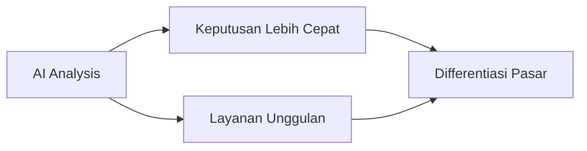
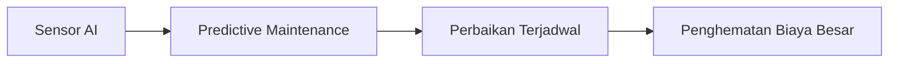
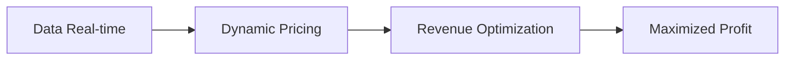
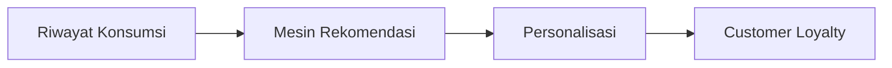
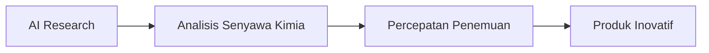
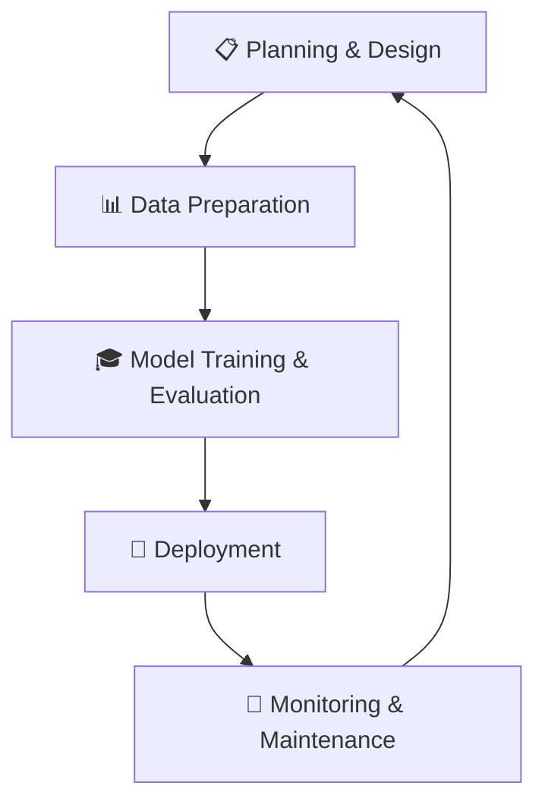
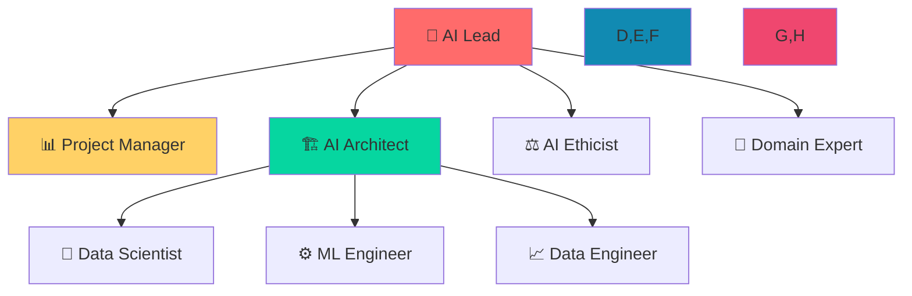
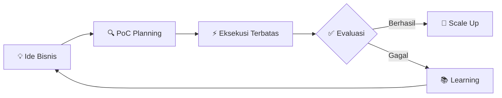
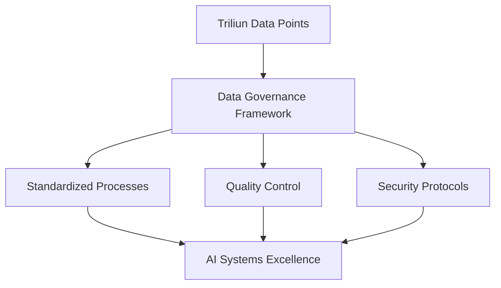

# 🚀 Laporan Lengkap (DATA 2): Panduan Strategis Mengimplementasikan AI di Organisasi

## 📊 Disusun Berdasarkan Analisis Sesi Interaktif Mengenai Strategi, Operasional, dan Budaya AI

---

## 🎯 Pendahuluan: Dari Konsep Teknis Menuju Keunggulan Bisnis

> **Transformasi AI bukan lagi pilihan, melainkan keharusan strategis!**

Jika laporan sebelumnya (DATA 1) membedah **"apa itu AI"** dari sudut pandang teknis, maka laporan ini akan fokus pada pertanyaan yang lebih krusial bagi para pemimpin dan praktisi:

### ❓ **"Bagaimana kita bisa memanfaatkan AI untuk memenangkan persaingan?"**

| **Laporan DATA 1** | **Laporan DATA 2** |
|-------------------|-------------------|
| 🧠 **Apa itu AI** | 🚀 **Bagaimana Implementasi AI** |
| 📚 Konsep Teknis | 💼 Strategi Bisnis |
| 🔧 Komponen Teknis | 🏢 Operasional Organisasi |

Mengadopsi AI menghadapi tantangan yang melampaui sekadar teknologi. **Laporan ini berfungsi sebagai panduan komprehensif** yang menguraikan langkah-langkah strategis untuk mengintegrasikan AI ke dalam DNA organisasi Anda.

### 🎯 **Cakupan Pembahasan:**
- 🏗️ Membangun visi dan fondasi yang kuat
- ⚙️ Mendirikan pilar operasional yang kokoh
- 📊 Mengukur keberhasilan secara efektif
- ⚠️ Mengantisipasi tantangan dan mitigasi risiko

**Tujuan akhir:** Mengubah AI dari sebuah *buzzword* menjadi **mesin penggerak nilai yang nyata dan berkelanjutan** bagi bisnis Anda.

---

## 🏗️ Bagian I: Membangun Organisasi Berbasis AI - Visi, Fondasi & Filosofi

> **"Sebelum menulis satu baris kode pun, transformasi AI harus dimulai dari puncak"**

### 1. 🎯 **Nilai Tambah Fundamental AI untuk Bisnis** (The "Why")

Mengapa organisasi harus berinvestasi dalam AI? Berikut **5 nilai strategis** yang sulit ditiru:

#### 🥇 **Menciptakan Keunggulan Kompetitif**

**Contoh:** Bank menggunakan AI untuk analisis risiko kredit → keputusan pinjaman lebih cepat dan akurat daripada kompetitor.

#### 💰 **Mengurangi Biaya Operasional**

**Contoh:** Perusahaan manufaktur menggunakan *predictive maintenance* → mencegah kerusakan fatal yang mahal.

#### 📈 **Meningkatkan Pendapatan dan Efisiensi**

**Contoh:** Sistem *dynamic pricing* di penerbangan → menyesuaikan harga berdasarkan permintaan dan perilaku konsumen.

#### 🤝 **Memberikan Pengalaman Pelanggan yang Superior**

**Contoh:** Netflix menganalisis riwayat tontonan → rekomendasi film yang dipersonalisasi → retensi pelanggan.

#### 💡 **Mendukung Inovasi Produk dan Layanan**

**Contoh:** Perusahaan farmasi menggunakan AI → mempercepat proses penemuan obat baru secara drastis.

### 2. 🎪 **Tiga Dimensi Krusial Adopsi AI** (The "How")

Transformasi AI yang sukses berdiri di atas **tiga pilar yang saling terkait**:

#### 📊 **Dimensi Bisnis** - Kompas Strategis

| Komponen | Deskripsi | Impact |
|----------|-----------|--------|
| **👑 Dukungan Pimpinan** | CEO, CTO sebagai sponsor utama | Visi, anggaran, kemauan politik |
| **🗺️ Roadmap yang Jelas** | Peta proyek AI prioritas | Arah yang terdefinisi, target terukur |
| **🎯 Fokus pada Bisnis** | "Masalah apa yang diselesaikan?" | ROI yang jelas, nilai nyata |

#### 💾 **Dimensi Data & Infrastruktur** - Mesin dan Bahan Bakar

| Elemen | Kebutuhan | Outcome |
|--------|-----------|---------|
| **📋 Strategi Data Matang** | Governance, kualitas, keamanan | Data siap pakai, compliant |
| **🖥️ Infrastruktur Tepat** | Cloud/On-premise, skalabilitas | Performa optimal, biaya efisien |

#### 👥 **Dimensi Orang & Budaya** - Jiwa Transformasi

| Aspek | Implementasi | Hasil |
|-------|--------------|-------|
| **🎓 Rekrutmen & Development** | Talent AI + upskilling karyawan | Tim kompeten, knowledge transfer |
| **🤝 Kolaborasi Lintas Fungsi** | Break silo departemen | Solusi holistic, alignment bisnis-teknis |
| **🔬 Budaya Eksperimen** | Safe to fail, learning mindset | Inovasi berkelanjutan, adaptasi cepat |
| **⚖️ Etika & Tanggung Jawab** | AI fairness, transparansi | Kepercayaan customer, sustainability |

---

## ⚙️ Bagian II: Fondasi Operasional AI - Infrastruktur, Metodologi & Tim

> **"Setelah visi ditetapkan, saatnya membangun mesin operasionalnya"**

### 1. 🏗️ **Fondasi Teknis: Memilih 'Dapur' yang Tepat**

#### ☁️ **Infrastruktur: Cloud vs. On-Premise**

| Aspek | **☁️ Cloud** | **🏢 On-Premise** |
|-------|-------------|------------------|
| **Skalabilitas** | 🚀 Elastis, scale up/down mudah | 📏 Terbatas, butuh investasi |
| **Biaya** | 💵 OpEx (bayar pemakaian) | 💰 CapEx (investasi besar awal) |
| **Kontrol** | 🔓 Managed service | 🔐 Kontrol penuh |
| **Keamanan** | 🛡️ Shared responsibility | 🛡️ Tanggung jawab penuh internal |
| **Regulasi** | 🌐 Standard compliance | 🏛️ Custom compliance mudah |

#### 🔄 **MLOps: Engine Produksi AI**

**MLOps adalah filosofi** yang mengadaptasi prinsip DevOps untuk Machine Learning:

- **⚡ Otomatisasi** siklus hidup model
- **🛡️ Standardisasi** proses
- **🔁 Kontinuitas** operasional
- **📈 Skalabilitas** enterprise

### 2. 👥 **Membangun Tim Juara** (The A-Team)

#### 🎯 **Struktur Tim AI yang Efektif**

#### 🎭 **Peran & Tanggung Jawab Detail**

| Peran | Fokus | Output |
|-------|-------|--------|
| **👑 AI Lead** | Strategi, vision, alignment bisnis-teknis | Roadmap AI, budget approval |
| **📊 Project Manager** | Timeline, resources, scope | Delivery on-time, within budget |
| **🏗️ AI Architect** | Arsitektur sistem, tech stack | Scalable, maintainable infrastructure |
| **🔬 Data Scientist** | Eksperimen, analisis, prototipe | Model proof-of-concept, insights |
| **⚙️ ML Engineer** | Production deployment, MLOps | Reliable, scalable AI systems |
| **📈 Data Engineer** | Data pipelines, infrastructure | Clean, accessible, high-quality data |
| **⚖️ AI Ethicist** | Fairness, transparency, compliance | Ethical AI guidelines, audit |
| **🎯 Domain Expert** | Business context, domain knowledge | Requirements, validation |

---

## 📊 Bagian III: Mengukur & Mengelola Proyek AI - Metrik, Risiko & Mitigasi

> **"How do we know it's working? And how do we prevent failure?"**

### 1. 📈 **Mengukur Kesuksesan: Metrik Teknis vs. Dampak Bisnis**

#### 🔬 **Pengukuran Offline** (Saat Development)

| Metrik | Tipe | Deskripsi | Contoh |
|--------|------|-----------|--------|
| **🎯 Akurasi** | Klasifikasi | % prediksi benar | 95% = 95 benar dari 100 |
| **📏 MAE/RMSE** | Regresi | Rata-rata error prediksi | Error harga rumah ±Rp 50 juta |
| **📊 Precision/Recall** | Binary Classification | Trade-off false positive/negative | Deteksi fraud yang optimal |

#### 💼 **Pengukuran Online** (Setelah Produksi)

| Metrik Bisnis | Deskripsi | Contoh Target |
|---------------|-----------|---------------|
| **📈 KPI Impact** | Dampak pada metrik bisnis utama | Turunkan churn 5% dalam 3 bulan |
| **💰 ROI** | Return on Investment | ROI 300% dalam 1 tahun |
| **⏱️ Efficiency Gain** | Penghematan waktu/operasional | Kurangi 40% waktu proses |
| **🔍 Model Health** | Pemantauan performa real-time | Deteksi model drift otomatis |

### 2. ⚠️ **Manajemen Risiko: Mengantisipasi Badai**

#### 🌪️ **Risiko Umum yang Mengintai**

| Kategori Risiko | Dampak | Contoh |
|-----------------|--------|--------|
| **🎭 Bias Data** | Keputusan diskriminatif | Rekrutmen AI bias gender |
| **🔮 Black Box Problem** | Tidak bisa dijelaskan | Penolakan kredit tanpa alasan jelas |
| **🛡️ Etika & Privasi** | Pelanggaran regulasi | Data leak, GDPR violation |
| **⚡ Keandalan Sistem** | Kegagalan operasional | Model error pada input tak terduga |

#### 🛡️ **Mitigasi dengan Proof-of-Concept (PoC)**

**Manfaat PoC:**
- 🔍 **Identifikasi risiko** sejak dini
- 💰 **Hemat biaya** sebelum investasi besar
- 🎯 **Validasi kelayakan** teknis dan bisnis
- 📊 **Data nyata** untuk pengambilan keputusan

---

## 🌍 Bagian IV: Tantangan & Studi Kasus Dunia Nyata

> **"Learning from those who've been there, done that"**

### 🚧 **Tantangan Umum dalam Praktik**

| Tantangan | Frekuensi | Dampak | Solusi |
|-----------|-----------|--------|--------|
| **💸 Sumber Daya Terbatas** | Sangat Tinggi | Stagnasi | Prioritisasi, cloud, outsourcing |
| **📉 Masalah Data** | Tinggi | Garbage in, garbage out | Data governance, quality pipeline |
| **🏢 Budaya Kaku** | Sedang | Resistensi perubahan | Change management, leadership |
| **🎯 Visi Tidak Selaras** | Sedang | Proyek gagal | Communication, shared goals |

### 🏆 **Inspirasi dari Para Raksasa**

#### 🔍 **Google** - Master of Data Governance

#### 🎓 **Airbnb** - Talent Strategy Genius
**Strategi Ganda:**
- 🎯 **Rekrutmen eksternal** - talenta AI terbaik
- 📚 **Upskilling internal** - program pelatihan intensif
- 🤝 **Knowledge sharing** - cross-team collaboration

#### ⚖️ **IBM** - Pioneer in AI Ethics
**Pendekatan Holistik:**
- 👥 **Dewan etika AI** internal
- 📜 **Framework responsible AI**
- 🌍 **Engagement regulasi** global
- 🔍 **Transparansi** dalam pengambilan keputusan

#### ☁️ **Netflix** - Cloud Infrastructure Visionary
**Strategic Bet:**
- 🚀 **Early cloud adoption**
- 🏗️ **Platform AI internal** custom
- 📊 **Real-time processing** untuk 200M+ users
- 🎯 **Personalization** pada scale masif

---

## 🎯 Kesimpulan Strategis

### 🚀 **Roadmap Menuju Organisasi AI-Driven**

### 💡 **Key Takeaways:**

1. **🎯 Start with Business Value** - AI untuk menyelesaikan masalah bisnis, bukan sekadar teknologi
2. **🏗️ Build Solid Foundation** - Data, infrastruktur, dan people sebagai pilar utama
3. **👥 Culture is Everything** - Transformasi membutuhkan perubahan mindset organisasi
4. **⚡ Iterate and Learn** - Mulai kecil, buktikan nilai, kemudian scale
5. **🛡️ Ethics and Responsibility** - Bangun kepercayaan melalui AI yang bertanggung jawab

### 🌟 **Final Thought:**
> **"The future belongs to organizations that can harness AI not just as a tool, but as a core capability woven into the very fabric of their operations and strategy."**

---

**📅 Laporan ini disusun sebagai panduan hidup** - terus beradaptasi dan berkembang seiring kemajuan teknologi AI dan kebutuhan bisnis Anda.

**🚀 Selamat memulai perjalanan transformasi AI organisasi Anda!**

----
----
Laporan Lengkap (DATA 2): Panduan Strategis Mengimplementasikan AI di Organisasi
Disusun Berdasarkan Analisis Sesi Interaktif Mengenai Strategi, Operasional, dan Budaya AI

Pendahuluan: Dari Konsep Teknis Menuju Keunggulan Bisnis
Jika laporan sebelumnya (DATA 1) membedah "apa itu AI" dari sudut pandang teknis, maka laporan ini akan fokus pada pertanyaan yang lebih krusial bagi para pemimpin dan praktisi: "Bagaimana kita bisa memanfaatkan AI untuk memenangkan persaingan?" Mengadopsi AI bukan lagi sekadar pilihan, melainkan sebuah keharusan strategis. Namun, perjalanan untuk menjadi organisasi yang benar-benar AI-driven penuh dengan tantangan yang melampaui sekadar teknologi.

Laporan ini berfungsi sebagai panduan komprehensif yang menguraikan langkah-langkah, fondasi, dan pertimbangan kritis dalam mengintegrasikan AI ke dalam DNA sebuah organisasi. Kita akan menyelami bagaimana cara membangun visi dan fondasi yang kuat, mendirikan pilar operasional yang kokoh, mengukur keberhasilan secara efektif, dan mengantisipasi badai tantangan yang mungkin menghadang. Tujuannya adalah untuk mengubah AI dari sebuah buzzword menjadi mesin penggerak nilai yang nyata dan berkelanjutan bagi bisnis Anda.

Bagian I: Membangun Organisasi Berbasis AI - Visi, Fondasi & Filosofi
Sebelum menulis satu baris kode pun, transformasi AI harus dimulai dari puncak—dengan visi yang jelas dan fondasi yang kokoh. Bagian ini membahas "mengapa" dan "bagaimana" secara garis besar sebuah perusahaan harus mengadopsi AI.

1. Nilai Tambah Fundamental AI untuk Bisnis (The "Why")
Mengapa sebuah organisasi harus bersusah payah berinvestasi dalam AI? Jawabannya terletak pada nilai tambah strategis yang fundamental dan sulit ditiru:

Menciptakan Keunggulan Kompetitif: Di pasar yang jenuh, AI memungkinkan perusahaan untuk berdiferensiasi. Contoh: Sebuah bank yang menggunakan AI untuk analisis risiko kredit dapat memberikan keputusan pinjaman lebih cepat dan akurat daripada kompetitornya.

Mengurangi Biaya Operasional: Otomatisasi cerdas adalah kunci efisiensi. Contoh: Perusahaan manufaktur menggunakan AI untuk predictive maintenance, di mana sensor dan model ML memprediksi kapan sebuah mesin akan rusak, sehingga perbaikan bisa dijadwalkan sebelum terjadi kerusakan fatal yang memakan biaya besar.

Meningkatkan Pendapatan dan Efisiensi: AI dapat memaksimalkan potensi pendapatan. Contoh: Sistem dynamic pricing di industri penerbangan yang secara otomatis menyesuaikan harga tiket berdasarkan permintaan, waktu, dan perilaku konsumen untuk memaksimalkan pendapatan per kursi.

Memberikan Pengalaman Pelanggan (CX) yang Superior: Personalisasi adalah raja. Contoh: Mesin rekomendasi Netflix yang menganalisis riwayat tontonan Anda untuk menyarankan film yang kemungkinan besar akan Anda sukai, membuat Anda terus berlangganan.

Mendukung Inovasi Produk dan Layanan: AI membuka pintu untuk menciptakan produk yang sebelumnya tidak mungkin. Contoh: Perusahaan farmasi menggunakan AI untuk menganalisis jutaan senyawa kimia dan mempercepat proses penemuan obat baru secara drastis.

2. Tiga Dimensi Krusial Adopsi AI (The "How")
Transformasi AI yang sukses berdiri di atas tiga pilar yang saling terkait:

Dimensi Bisnis: Ini adalah kompas strategis. Tanpa ini, inisiatif AI akan berjalan tanpa arah. Kuncinya adalah:

Dukungan Penuh dari Pimpinan (C-Level Buy-in): CEO, CTO, dan jajaran direksi harus menjadi sponsor utama, menyediakan visi, anggaran, dan kemauan politik.

Roadmap yang Jelas: Sebuah peta jalan yang mendefinisikan proyek-proyek AI prioritas, target jangka pendek dan panjang, serta bagaimana setiap inisiatif akan berkontribusi pada tujuan bisnis utama.

Fokus Obsesif pada Kesuksesan Bisnis: Setiap proyek AI harus dimulai dengan pertanyaan: "Masalah bisnis apa yang ingin kita selesaikan?" atau "Peluang apa yang ingin kita raih?"

Dimensi Data & Infrastruktur: Ini adalah mesin dan bahan bakar.

Strategi Data yang Matang: Sebuah kebijakan komprehensif yang mengatur bagaimana data dikumpulkan, disimpan, dibersihkan, diamankan, dan diakses. Ini adalah fondasi dari segalanya.

Investasi Infrastruktur yang Tepat: Memilih arsitektur yang tepat (Cloud, On-Premise, atau Hybrid) yang dapat mendukung kebutuhan komputasi dan penyimpanan data yang masif.

Dimensi Orang & Budaya: Ini adalah jiwa dari transformasi.

Merekrut dan Mengembangkan Talenta: Menarik para ahli AI dan secara bersamaan meningkatkan keterampilan (upskilling) karyawan yang ada.

Mendorong Kolaborasi Lintas Fungsi: Memecah "silo" antar departemen. Tim AI tidak bisa bekerja dalam ruang hampa; mereka membutuhkan input dari tim produk, pemasaran, dan penjualan.

Mempromosikan Budaya Belajar & Eksperimen: AI adalah bidang yang berkembang pesat. Perusahaan harus menciptakan lingkungan yang aman bagi karyawan untuk bereksperimen, belajar dari kegagalan, dan terus-menerus beradaptasi.

Menegakkan Etika dan Tanggung Jawab: Membangun kepercayaan dengan pelanggan dan publik dengan memastikan AI digunakan secara adil, transparan, dan bertanggung jawab.

Bagian II: Fondasi Operasional AI - Infrastruktur, Metodologi & Tim
Setelah visi ditetapkan, saatnya membangun mesin operasionalnya. Bagian ini menyelami aspek teknis dan sumber daya manusia yang dibutuhkan untuk menjalankan inisiatif AI sehari-hari.

1. Fondasi Teknis: Memilih "Dapur" yang Tepat
Infrastruktur: Cloud vs. On-Premise

Cloud (Berbasis Awan): Model dominan saat ini. Perusahaan menyewa sumber daya dari penyedia seperti Amazon Web Services (AWS), Google Cloud Platform (GCP), atau Microsoft Azure.

Kelebihan: Elastisitas & Skalabilitas (bayar sesuai pemakaian, mudah di-scale up/down), akses ke alat-alat AI canggih dan model pre-built.

Model Biaya: OpEx (Operational Expenditure), lebih mudah untuk memulai.

On-Premise (Milik Sendiri): Perusahaan membeli dan mengelola server, penyimpanan, dan jaringannya sendiri.

Kelebihan: Kontrol Penuh atas data dan keamanan, penting untuk industri dengan regulasi ketat (misalnya, perbankan atau pertahanan).

Model Biaya: CapEx (Capital Expenditure), membutuhkan investasi awal yang sangat besar.

MLOps (Machine Learning Operations): Praktik Terbaik untuk Produksi AI

MLOps adalah filosofi dan serangkaian praktik yang mengadaptasi prinsip-prinsip DevOps untuk dunia Machine Learning. Tujuannya adalah untuk mengotomatisasi dan menstandarisasi siklus hidup model AI, membuatnya lebih cepat, andal, dan dapat diulang. Siklusnya bersifat kontinu:

Perencanaan & Desain: Mendefinisikan masalah bisnis dan metrik kesuksesan.

Persiapan Data: Membangun data pipelines yang otomatis untuk mengumpulkan, membersihkan, dan melabeli data.

Pelatihan & Evaluasi Model: Melatih beberapa model secara paralel dan mengevaluasinya secara otomatis.

Deployment: Menerapkan model terbaik ke lingkungan produksi dengan cara yang aman dan terkontrol.

Pemantauan & Pemeliharaan: Terus-menerus memantau performa model di dunia nyata dan memicu pelatihan ulang secara otomatis jika terdeteksi adanya degradasi.

2. Membangun Tim Juara (The A-Team): Peran & Tanggung Jawab
Sebuah tim AI yang efektif adalah perpaduan harmonis dari berbagai keahlian:

Pilar Kepemimpinan:

AI Lead: Visioner yang menerjemahkan strategi bisnis ke dalam strategi teknis AI.

Project Manager: Eksekutor yang memastikan proyek berjalan sesuai jadwal, anggaran, dan ruang lingkup.

Pilar Eksekusi (Tim Inti Teknis):

AI Architect: Perancang sistem. Memutuskan arsitektur keseluruhan, platform, dan tumpukan teknologi (tech stack) yang akan digunakan.

Data Scientist: Penjelajah data. Menganalisis data, melakukan eksperimen, dan membangun prototipe model ML untuk memvalidasi hipotesis.

ML Engineer: Pembangun jembatan ke produksi. Mengambil model prototipe dari Data Scientist dan mengubahnya menjadi kode yang andal, efisien, dan siap di-deploy dalam skala besar.

Data Engineer: Pembangun "jalan tol data". Merancang dan membangun data pipelines yang memastikan data berkualitas tinggi tersedia untuk Data Scientist.

Pilar Pendukung:

AI Ethicist: Penjaga moral. Memastikan solusi AI yang dibangun adil, transparan, dan tidak merugikan.

Domain Expert: Penerjemah konteks. Seorang ahli di bidangnya (misalnya, dokter untuk proyek AI medis) yang memberikan pemahaman bisnis yang mendalam kepada tim teknis.

Bagian III: Mengukur & Mengelola Proyek AI - Metrik, Risiko & Mitigasi
Bagaimana kita tahu sebuah proyek AI berhasil? Dan bagaimana cara kita mengantisipasi kegagalan? Bagian ini membahas keduanya.

1. Mengukur Kesuksesan: Metrik Teknis vs. Dampak Bisnis
Pengukuran Offline (Saat Development): Fokus pada performa teknis model sebelum menyentuh pengguna.

Akurasi (Classification): Persentase tebakan yang benar. Akurasi 95% berarti model menebak benar 95 dari 100 kali.

Error (Regression): Seberapa jauh rata-rata tebakan model dari nilai sebenarnya. Contoh: Mean Absolute Error (MAE).

Pengukuran Online (Setelah Produksi): Fokus pada nilai bisnis yang dihasilkan.

KPI (Key Performance Indicator): Metrik bisnis yang terukur dan spesifik. Contoh: "Penurunan tingkat churn pelanggan sebesar 5% dalam 3 bulan setelah peluncuran mesin rekomendasi."

Pemantauan Degradasi Model: Performa model di dunia nyata bisa menurun seiring waktu karena perubahan perilaku konsumen atau tren pasar (model drift). Pemantauan berkelanjutan sangat penting untuk mendeteksi ini dan memicu pelatihan ulang.

2. Manajemen Risiko: Mengantisipasi Badai
Risiko Umum yang Mengintai:

Bias Data: Model yang dilatih dengan data yang bias akan menghasilkan keputusan yang bias.

Kurangnya Transparansi (Black Box Problem): Sulitnya menjelaskan logika di balik keputusan model AI canggih.

Masalah Etika & Privasi: Pelanggaran privasi data pengguna.

Keandalan & Keamanan: Kerentanan model terhadap serangan (adversarial attacks) atau kegagalan saat menghadapi input yang tak terduga.

Mitigasi Risiko dengan Proof-of-Concept (PoC):

Sebuah PoC adalah proyek skala kecil dengan tujuan tunggal: membuktikan kelayakan teknis dan potensi nilai bisnis dari sebuah ide AI. Dengan menjalankan PoC, perusahaan dapat mengidentifikasi risiko teknis, data, dan bisnis sejak dini sebelum menginvestasikan sumber daya dalam skala penuh.

Bagian IV: Tantangan & Studi Kasus Dunia Nyata
Perjalanan adopsi AI tidak selalu mulus. Bagian ini melihat tantangan praktis dan bagaimana perusahaan besar berhasil menavigasinya.

Tantangan Umum dalam Praktik:

Kurangnya Sumber Daya: Hambatan paling umum, baik dari sisi anggaran, infrastruktur komputasi, maupun ketersediaan talenta.

Masalah Data: Data terperangkap dalam silos departemen, berkualitas buruk, atau jumlahnya tidak mencukupi.

Budaya Perusahaan yang Kaku: Resistensi terhadap perubahan dari karyawan dan manajemen menengah.

Kurangnya Visi Bersama: Ketidakselarasan antara tim teknis dan tim bisnis tentang tujuan dan prioritas inisiatif AI.

Inspirasi dari Para Raksasa:

Google (Tantangan Data): Membangun kerangka kerja data governance kelas dunia untuk mengelola dan mengintegrasikan triliunan titik data secara efektif dan aman.

Airbnb (Tantangan Talenta): Menerapkan strategi ganda: merekrut talenta AI terbaik dari luar sambil secara masif meningkatkan keterampilan (upskilling) karyawan internal melalui program pelatihan intensif.

IBM (Tantangan Etika): Menjadi pelopor dalam AI yang bertanggung jawab dengan membentuk dewan etika AI internal dan secara aktif terlibat dalam pembuatan regulasi AI global.

Netflix (Tantangan Infrastruktur): Bertaruh besar pada infrastruktur cloud sejak awal dan membangun platform AI internal mereka sendiri untuk mengelola skala operasi yang masif, dari pemrosesan data hingga menjalankan mesin rekomendasi secara real-time untuk ratusan juta pengguna.